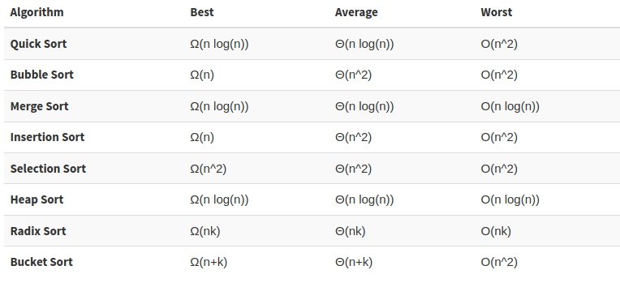

# Pysort
Python program that shows some sorting algorithms visually with graphs.

This contemplates Bogo Sort, Bubble Sort, Bucket Sort, Heap Sort, Insertion Sort, Merge Sort, Radix Sort, Selection Sort, Smooth Sort and Quick Sort.

It doesn't makes any comparison between these alghoritms, its just a visual representation of the methods.

## Running
```bash
$ python3.7 pysort.py [sorting method]
```
Where `[sorting method]` can be one of the following: `bogo`, `bubble`, `bucket`, `heap`, `insertion`, `merge`, `radix`, `selection`, `smooth`, `quick`.

## Leonardo Zanotti
