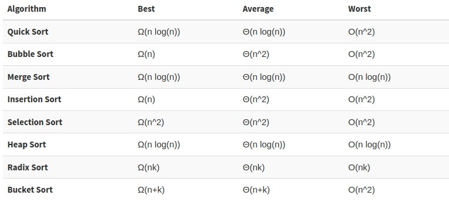

# Pysort
Python program that shows some sorting algorithms visually with graphs.

This contemplates Bogo Sort, Bubble Sort, Bucket Sort, Heap Sort, Insertion Sort, Merge Sort, Radix Sort, Selection Sort and Quick Sort.

It doesn't makes any comparison between these alghoritms, its just a visual representation of the methods.

## Running
```bash
$ python3.7 pysort.py [sorting method] [save]
```

Where:

* `[save]` is a optional parameter, used to save or not the animation in a gif. To just show the animation, let it blank, to save as gif, type "save" in this arg.

* `[sorting method]` can be one of the following: `bogo`, `bubble`, `bucket`, `heap`, `insertion`, `merge`, `radix`, `selection`, `quick`.

Examples:
```bash
$ python3.7 pysort.py quick         ## shows the quick sort animation
$ python3.7 pysort.py radix save    ## saves the radix sort animation as gif
```

## Leonardo Zanotti
